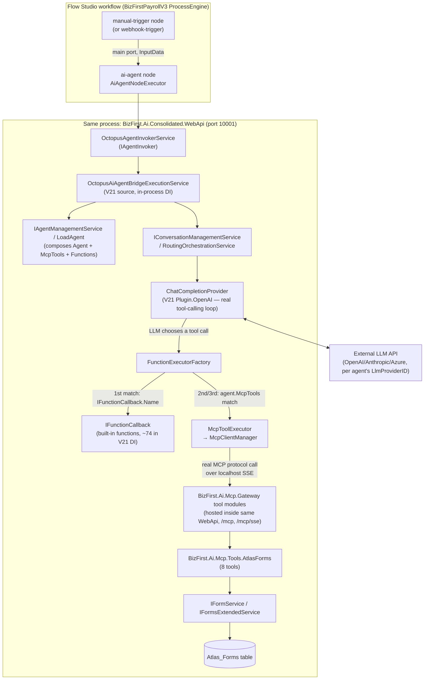

# Atlas Forms Automation — End-to-End Architecture

Status: research/documentation only, written 2026-08-23 as Task 1 of Binoy's 5-task plan ("Understand
the whole work, flow, lifecycle and complete and figure out end to end design and artifacts"). No code
was written, no DB was modified. This is the reference doc Tasks 2-5 build against. See
`design-and-plan.md` for the project's task history and `lessons/README.md` for a chronological log of
concrete findings.

Everything below was traced from real code (file paths and class names cited throughout) plus, where
noted, from already-written companion RAG spec docs in
`Documentation\Employees\agentic-coding\bizfirst-ai-mcp-servers-spec\workflow-nodes-rag\` that this pass
re-verified rather than re-derived. Anything not independently confirmed this pass is explicitly marked
**OPEN QUESTION** — do not treat unmarked statements as guesses.

## 1. The single most important finding: V21 is in-process, not a network bridge

`OctopusAgentInvokerService`'s doc comment ("Bridges Process Engine AI Agent nodes with the V21 AI
Engine") describes a real architectural relationship, but "bridge" does **not** mean a network hop. It
is a same-process, same-binary DI call chain:

```
AiAgentNodeExecutor (BizFirstPayrollV3)
  → IAgentInvoker → OctopusAgentInvokerService (BizFirstPayrollV3)
    → IOctopusAiAgentBridgeExecutionService → OctopusAiAgentBridgeExecutionService (BizFirstAI.V21 source)
      → IAgentManagementService / IConversationManagementService (V21 Octopus Core)
        → ChatCompletionProvider (V21, real OpenAI SDK tool-calling loop)
```

**Hard proof, not inference:**

- `BizFirst.Ai.Platform.Web.Server.Core.csproj` and `...Core.CoreV1.csproj` (the Consolidated WebApi —
  `BizFirstPayrollV3\src\mvc-server\Platform\WebServer\BizFirst.Ai.Platform.Web.Server.Core\`) both
  carry direct `<ProjectReference>` entries to
  `BizFirstAI.V21\src\ApiServer\src\Infrastructure\BizFirst.Ai.Octopus.Core\BizFirst.Ai.Octopus.Core.csproj`
  and its sibling V21 infrastructure/plugin projects
  (`...ProcessEngine.Adapter.Services`, `...Octopus.Abstraction`, `...Plugin.SqlServerAtlasStorage`,
  `...Plugin.OpenAI`).
- `BizFirst.Ai.Consolidated.WebApi.Mini.csproj` carries the same `<ProjectReference>`s (lines ~242-251).
- V21's own `DevelopmentHistoryLog.md`
  (`BizFirstAI.V21\src\ApiServer\src\Infrastructure\BizFirst.Ai.Octopus.Core\DevelopmentHistoryLog.md`,
  2026-08-19 entry) states a fix was "verified via a full rebuild of the actual deployed consumer,
  `BizFirstPayrollV3\...\BizFirst.Ai.Consolidated.WebApi.csproj` (cross-repo `ProjectReference` to this
  project) — 0 errors, confirming the fix compiles cleanly into the real binary that serves this code
  path, not just in isolation."
- The real (non-stub) implementation, `OctopusAiAgentBridgeExecutionService`
  (`BizFirstAI.V21\src\ApiServer\src\Infrastructure\BizFirst.Ai.Octopus.ProcessEngine.Adapter.Services\Services\Agent\OctopusAiAgentBridgeExecutionService.cs`),
  does pure in-process DI resolution (`_services.GetRequiredService<IAgentManagementService>()`) and
  calls `convService.SendMessage(originContext)` — **no `HttpClient`, no gRPC, no connection string, no
  base URL anywhere in the class.** Registration
  (`ProcessEngineOctopusBridgeExtensions.AddProcessEngineAgentServices`) is ordinary
  `services.AddScoped<IOctopusAiAgentBridgeExecutionService, OctopusAiAgentBridgeExecutionService>()`.
- `ServiceCollectionExtensionsForAI.RegisterAiStudio`
  (`BizFirstPayrollV3\...\BizFirst.Ai.Platform.Web.Server.Core\DependencyInjection\Ai\ServiceCollectionExtensionsForAI.cs`)
  calls `services.AddBizFirstAICore(configuration)` directly, with its own comment: *"V21 core: registers
  PluginLoader, ICacheService, ISettingService, ITemplateRender... Required before `UseBizFirstAI()` is
  called in the middleware pipeline."*
- A stub fallback exists (`StubAgentExecutionService`/`StubFunctionBridgeService`,
  `BizFirst.Ai.ExecutionNodes.Octopus.Services\Testing\`), used only when
  `AddProcessEngineAgentServices()` was never called before `RegisterNodeExecutors()` — i.e. a
  test/misconfiguration fallback, not the live path.

**Net effect:** "V21" and "BizFirstPayrollV3" are two separate *source repos*, but they compile into one
running binary (`BizFirst.Ai.Consolidated.WebApi`). There is no separate V21 host process an AI Agent
node call goes out to over HTTP. This is exactly the relationship CLAUDE.md's own module-boundary rule
implies ("Octopus.Core must never reference BizFirstPayrollV3 service projects directly; always route
through SqlServerAtlasStorage / IRepositoryBase") — a same-process layering rule, not a network-boundary
rule.

**Nuance — not everything in V21 is live.** The live process's `PluginLoader:Assemblies` config
(`BizFirst.Ai.Consolidated.WebApi\appsettings.json`) only lists `BizFirst.Ai.Octopus.Core`,
`...Plugin.SqlServerAtlasStorage`, `...Plugin.OpenAI`. **`BizFirst.Ai.Octopus.Plugin.KnowledgeBase` is
absent from this list and has no `<ProjectReference>` anywhere in the live host's `.csproj` files.**
So while V21's Agent/Routing/MCP-dispatch code is genuinely live and in-process, the
`KnowledgeRetrievalFn`/`KnowledgeBasePlugin`/`KnowledgeHook` code (Section 4 below) specifically is real
V21 source that is **not wired into the currently running binary** — dead code in the live call graph,
confirming and sharpening `lessons/README.md`'s prior finding that "Knowledge Retriever" doesn't exist
in the reachable stack.

## 2. Component diagram



Key point the diagram makes explicit: the MCP "hop" (`McpToolExecutor` → `MCPServer`) is a **genuine**
MCP-protocol network call (SSE, `https://localhost:10001/mcp/sse`) — V21's routing code is the MCP
*client*, and the very same `BizFirst.Ai.Consolidated.WebApi` process is also the MCP *server* hosting
the Atlas Forms tools. It is a real client/server MCP exchange, just both ends currently live in one
process on one box. The Agent-execution "bridge" (Section 1) is not this kind of hop — that one is a
plain in-process method call.

## 3. End-to-end execution lifecycle, step by step

1. **Trigger fires.** Simplest option: `manual-trigger` node (node type code `manual-trigger`,
   `ManualTriggerNodeSettings` — zero required config, cannot fail, forwards `InputData` unchanged to
   `main`). A webhook (`webhook-trigger`, `POST /api/webhook/{**path}`) works too if an external caller
   needs to start the run.
2. **`ai-agent` node executes.** Executor: `AiAgentNodeExecutor`
   (`BizFirstPayrollV3\src\mvc-server\AI\ExecutionNodes\Octopus\BizFirst.Ai.ExecutionNodes.Octopus.OctopusAi\AiAgent\Executor\AiAgentNodeExecutor.cs`),
   `public const string NodeTypeName = "ai-agent"`, extends
   `BaseHilNodeExecutor<OctopusAiAgentNodeExecutorSettings>`. Routes on `(resource, operation)` —
   currently only `("message","send")` and `("message","chat")` are handled. For `send`, execution goes
   through `ExecuteInternalNonHilAsync` → `_SendMessage` (in
   `AiAgentNodeExecutor.SendMessage.cs`), which:
   - Validates `internalNodeExecutionContext.OriginReader.AgentID` is a positive int (fails to the
     error port otherwise — `agentID` really is the only mandatory field).
   - Copies the node's resolved `InputData` onto the bridge context
     (`internalNodeExecutionContext.InputData = new Dictionary<string, object>(elementExecutionContext.InputData ?? [])`).
   - Calls `await _agentInvoker.InvokeAgentAsync(internalNodeExecutionContext, cancellationToken)` —
     `_agentInvoker` is DI-resolved as `IAgentInvoker` → `OctopusAgentInvokerService` in the live host.
3. **In-process bridge into V21 (Section 1).** `OctopusAgentInvokerService` calls
   `IOctopusAiAgentBridgeExecutionService.ExecuteAgentAsync(...)` → V21's
   `OctopusAiAgentBridgeExecutionService` resolves `IAgentManagementService`, loads/composes the target
   `AIAgent_Agents` row (LLM config, instructions, MCP tool grants, sub-agents — see Section 5), and
   calls into `IConversationManagementService`/routing to actually run a turn.
4. **LLM call with real function/tool-calling.** `ChatCompletionProvider.cs`
   (`BizFirstAI.V21\...\Plugin.OpenAI\Providers\Chat\ChatCompletionProvider.cs`, ~line 663) builds
   `var functions = agent.Functions.Concat(agent.SecondaryFunctions ?? [])`, then for each adds
   `options.Tools.Add(ChatTool.CreateFunctionTool(...))` — the official OpenAI .NET SDK's standard
   tool-list mechanism. This is a normal OpenAI/Anthropic-style function-calling request: the full tool
   catalogue is sent every turn, and the model decides whether/which tool to call
   (`ChatFinishReason.FunctionCall`/`.ToolCalls`).
5. **Dispatch of a chosen tool call.** `FunctionExecutorFactory.Create`
   (`BizFirstAI.V21\...\Octopus.Core\Routing\Executor\FunctionExecutorFactory.cs`) resolves the called
   function name in strict priority order — see Section 4 for the full mechanics:
   1. A DI-registered `IFunctionCallback` matching by `.Name` → built-in/native function.
   2. A `FunctionDef` with a static `.Output` template → mock/test executor.
   3. An `agent.McpTools` entry whose (server, function) resolves → `McpToolExecutor` → real MCP
      protocol call against the live server.
   4. Unresolved → logged as a dispatch failure ("Can't find function implementation of X").
6. **Atlas Forms tool executes (if that's what was called).** `McpToolExecutor` →
   `McpClientManager.GetMcpClientAsync(serverId,...)` → resolves the `AIMCP_McpServers` row → builds an
   `SseClientTransport` against `ConfigJson.SseConfig.EndPoint` (`https://localhost:10001/mcp/sse` for
   Atlas Forms/Credentials/Workflow) → real `ModelContextProtocol.Client.CallToolAsync(functionName,
   args)`. On the server side, `BizFirst.Ai.Mcp.Tools.AtlasForms`'s `[McpServerTool]` method runs
   in-process against `IFormService`/`IFormsExtendedService` and returns a structured result.
7. **Result flows back.** The MCP result becomes the function-call result message in the LLM
   conversation; the LLM produces its final response; `OctopusAiAgentBridgeExecutionService` returns an
   `AgentInvocationResult` back up through the bridge; `AiAgentNodeExecutor.PrepareOutputData` maps it
   into the node's output data (`content`, `status`, `portName`, plus cost/conversation-ID metadata via
   `MergeBridgeResponseFields`), and the node completes on `main` (or `error`).

## 4. MCP tools vs. built-in functions — two genuinely separate mechanisms, confirmed

**They are not the same system, and neither one is blocked by the DB rows that look empty/NULL.**

- **Built-in/native functions** (`AIFunction_AgentFunctions`, 33 rows, all with `Assembly`/`ClassName`/
  `MethodName` NULL): these NULL columns are **irrelevant to real dispatch**. Real built-in functions
  are ordinary C# classes implementing `IFunctionCallback` (e.g. `RouteToAgentFn.cs`,
  `MemorizeKnowledgeFn.cs`, `KnowledgeRetrievalFn.cs` — ~74 across V21), registered directly in V21's DI
  container at startup, matched purely by their `.Name` property
  (`services.GetServices<IFunctionCallback>().FirstOrDefault(x => x.Name == functionName)`).
  `AIFunction_AgentFunctions` lives in a different repo/module (`BizFirst.Ai.AIFunction.*`,
  BizFirstPayrollV3) that the V21 execution path never reads to wire dispatch — it appears to be an
  admin/catalog table with no discovery-to-DB sync job, not a live registry.
- **MCP tools** (`AIMCP_McpServers`/`AIMCP_McpTools`): `AIMCP_McpTools` (11 rows, zero for Atlas
  Forms/Credentials/Workflow) is **never read at dispatch time either.** Per
  `bizfirst-ai-mcp-servers-spec\overview.md`'s own confirmed finding, this table is only an optional
  **per-agent allow-list filter** (`McpTool.Functions`) — "a function-less entry exposes ALL of the
  server's tools; a function-less entry with declared functions filters to that subset." Real tool
  *discovery* happens live: `McpToolAgentHook.OnAgentMcpToolLoaded` fires per agent load, calls
  `mcpClient.ListToolsAsync()` (a genuine MCP `tools/list` protocol round-trip against the running
  server), and appends the returned schemas into `agent.SecondaryFunctions`. So an agent with an empty
  `AIMCP_McpTools` allow-list still sees **every** tool the live server currently reports — the empty
  table is not a blocker, it's the "expose everything" default.
- **Both paths converge at the same dispatcher**, `FunctionExecutorFactory.Create` (Section 3, step 5) —
  this is the one place "which mechanism handles this call" gets decided, and it does so per-call, not
  via any static registry table.

**Is Atlas Forms tool-calling functional right now?** Mechanically, very likely yes. Every layer needed
is confirmed live: `BizFirst.Ai.Consolidated.WebApi` listening on port 10001, `/mcp`/`/mcp/sse` routes
mapped (`app.MapMcp("/mcp")`, official `ModelContextProtocol.AspNetCore` SDK), `AIMCP_McpServers`
`ConfigJson` for the Atlas Forms/Credentials/Workflow servers (IDs 8/9/10) correctly pointing at
`https://localhost:10001/mcp/sse`, and a live `tools/list` call previously confirmed to return exactly
the 8 real Atlas Forms tool names (per the referenced 2026-08-19 dev log entry). None of this depends on
`AIMCP_McpTools`/`AIFunction_AgentFunctions` being populated.

**Real open gap found, not a functional blocker but a genuine security issue: no authorization
enforcement on MCP tool calls today.** A path-scoped middleware
(`PlatformWebServerExtensionsByApp.cs`) seeds a fixed `TenantID=1`/system identity plus (as of a
2026-08-19 fix) an `X-Mcp-Agent-Id`-derived `ClaimsPrincipal` with role `McpAgentWriter` for every `/mcp`
request — but the actual `[McpServerTool]` methods call `IFormService`/`IFormsExtendedService` directly,
bypassing `MapControllers()` entirely, so `[AuthorizeTenantAdminAttribute]`/
`[AuthorizeRegularUserAttribute]` never execute for a real MCP call. **Any agent wired to these MCP
servers can currently write Atlas Forms/Credentials/Workflow data with zero authorization enforcement.**
This mirrors — and is the concrete, already-partially-built instance of — the open authorization question
`octopus-agent-mcp-design.md` §5.4 raised for the not-yet-built Octopus MCP server. Flagging this
explicitly for whoever builds Task 4/5: functionally fine for a controlled test, but not something to
leave as-is before wider rollout.

## 5. How `toolServers` config attaches to a specific agent — two layers

1. **Baseline, DB-driven, per agent record.** `AgentService.LoadAgent.cs` comment
   (`BizFirstAI.V21\...\Agents\Services\AgentService.LoadAgent.cs`): *"agent.McpTools is now populated
   DB-first via `AgentTranslator.MapMcpTools` (`agent.McpServerGroupID` → `AIMCP_McpServerGroupMembers`
   → `AIMCP_McpServers`)."* So an `AIAgent_Agents` row's `McpServerGroupID`/`McpEnabled`/`CredentialID`
   scalar columns resolve, through a group-membership junction table, to one or more `AIMCP_McpServers`
   rows — not a `ConfigJson` blob directly on the agent.
2. **Instance-level override, per Flow Studio node.** `OctopusAiAgentBridgeOriginReader.McpServers.cs`
   reads the node's own `Configuration` JSON key `toolServers.servers[]`
   (`OctopusToolServersInfo`/`McpServerInfo.FromJson`) — this is **additive**, merged into the agent's
   DB-driven baseline via `ProcessEngineAgentOverrideSource.Apply(agent)`
   (`BizFirstAI.V21\...\ProcessEngine.Adapter.Services\Services\Agent\ProcessEngineAgentOverrideSource.cs`),
   called inside `LoadAgent` **before** `McpToolAgentHook.OnAgentMcpToolLoaded` fires, so the hook's
   live `tools/list` calls see the extended set. Per `LoadAgent`'s own code comment this override is
   currently append-only (not yet an overwrite) — a TODO'd phase 2. Canvas `team-member`/tool-role
   satellite nodes merge into this same `toolServers` config key.

## 6. RAG / Knowledge retrieval status — unchanged blocker, now precisely located in the dead-code map

Everything `lessons/README.md`'s 2026-08-23 entry found still holds; this pass adds the precise
"is it even reachable" answer from Section 1:

- The real, wired ingestion pipeline is `Go.Documents` + `FlowRag`/`RagCollectionResolver`/
  `RagDocumentCreateProcessor` — confirmed real, wired, fail-open (indexes into Qdrant, leaves
  `RagKnowledgeID`/`RagProviderName`/`RagIndexedOn` NULL on failure). Qdrant is still unreachable in
  this environment (no Docker).
- The retrieval side — `KnowledgeHook`/`KnowledgeRetrievalFn`/`util-kg-knowledge_retrieval` — lives
  entirely in `BizFirst.Ai.Octopus.Plugin.KnowledgeBase` (V21). **Now confirmed definitively (Section
  1): this specific plugin is absent from the live host's `PluginLoader:Assemblies` config and has no
  `<ProjectReference>` anywhere in the currently-running binary.** It is not merely "legacy" in a vague
  sense — it is real, compilable V21 code that the live `BizFirst.Ai.Consolidated.WebApi` process
  genuinely does not load today. Wiring it in would need (a) adding the missing `<ProjectReference>` +
  `PluginLoader:Assemblies` entry, (b) a reachable Qdrant/Postgres vector store, and (c) resolving
  `BaseKnowledgeController.cs`'s already-documented "no search/query/retrieval endpoint" gap on the
  `Go.Documents`/`FlowRag` side that the live host's Knowledge UI actually writes to — these are two
  different knowledge stacks (Finding 0 of `rag-collection-name-flow-through-agent-metadata.md`) that
  don't talk to each other today.
- **Net for Atlas Forms**: RAG-backed retrieval of the `atlas-forms-rag/v2` spec is not functional in
  the live stack yet, for the same reasons already documented, now traced one layer deeper (the plugin
  simply isn't loaded, not just "not populated"). This remains real, non-trivial follow-up scope, not
  something to build blind as part of this task.

## 7. Flow Studio's `ai-agent` node — what a user configures, and what a minimal workflow needs

**Node type**: `ai-agent` (`Process_ProcessElementTypes.Code`). Executor: `AiAgentNodeExecutor`
(confirmed directly, Section 3). **Casing gotcha, confirmed against real code**: config key is
`agentID` (capital ID per this codebase's convention), even though the executor's own older doc comment
shows `agentId` — the real reader (`OctopusAiAgentBridgeOriginReader.AgentID`) reads `agentID`.

**Minimum required config**: `agentID` (int, the target `AIAgent_Agents` row — this is the *only*
mandatory field) and, for a normal turn, `message` (string). Everything else is optional:
`resource`/`operation` default to `"message"`/`"send"`; `invocationMode` defaults to `sync`.

**Everything else a user can configure** (all optional, all additive/override on top of the target
agent's own DB-persisted config — see the companion RAG docs
`workflow-nodes-rag\nodes\ai-agent\*.md` for full field tables, re-verified this pass, not re-derived):
- **Conversation scope/identity** (`conversation-scope.md`): `operation` (`send` vs `chat`),
  `ConversationScope`/`ConversationMode`/`ConversationIsolation` (nested object, 11×3×9 real enum
  combinations — the DB `ConfigurationSchema` seed is confirmed wrong here, only 2 flat values), explicit
  `conversationID`, postback fields for resuming a paused tool call.
- **HIL/suspend-resume** (`hil-features.md`): fixed, non-configurable — `send` never suspends; `chat`
  always suspends on its first turn (`waiting` port), resumed via `ExecutionResID`/`NodeKey`, not a
  general Engage/Inbox session.
- **Invocation & agent resolution** (`invocation-and-agent-resolution.md`): `agentResID`/`agentName`
  (informational, not cross-validated against `agentID`), `channel`/`agentChannels`, memory/owner-axis
  qualifiers (`memoryID`/`tenantID`/`roleID`/`appID`), `userInstructions`, action-context inclusion
  flags (`includeInputDataInActionContext` etc. — controls whether the node's `InputData` crosses the
  bridge into the agent's context; this is the flag `documentCollectionNames`-style metadata forwarding
  would depend on, per `rag-collection-name-flow-through-agent-metadata.md`).
- **Tool servers, LLM override, sub-agents** (`tool-servers-and-llm.md`, Section 5 above): `llm.*`
  (replaces the agent's own LLM config when present), `toolServers.servers[]` (merges MCP servers),
  canvas-wired `team-member` satellite sub-agents (not expressible as a config key — separate node
  wiring).
- **Prompt-segment overrides**: 9 independent optional fields merged additively into the target agent's
  prompt (see `prompt-overrides.md`).

**DB `ConfigurationSchema` for `ai-agent` is confirmed severely stale** — do not trust it for anything;
it reflects an older API shape (`MessageSource`, flat `ConversationScope` enum, etc.) that doesn't match
the current settings classes on numerous points. Author workflows against the real fields above, not
the seeded schema.

**What a minimal "trigger → AI Agent node → creates a form" workflow concretely needs:**

1. **A real, existing `AgentID`** — an `AIAgent_Agents` row with `McpEnabled=1`/`McpServerGroupID`
   pointing at (or including) the Atlas Forms MCP server (ID 8, `McpServerGroupID` per its group
   membership), so `agent.McpTools`/`SecondaryFunctions` includes the 8 Atlas Forms tools at load time.
   This is Task 2's deliverable — this doc does not re-derive it, but the concrete `AgentID` needs to be
   recorded in `lessons/README.md` once Task 2's real output is confirmed (not found in the docs read
   for this pass).
2. **A workflow with two nodes**: a `manual-trigger` node (empty config is valid) wired via a `main`
   connection to an `ai-agent` node with `Configuration = { "agentID": <TheAgentID>, "message":
   "<natural-language instruction, e.g. Create a customer onboarding form with name/email/phone
   fields>" }`. `resource`/`operation` can be omitted (defaults to `message`/`send` — the simple,
   non-HIL one-shot path, appropriate for a scripted test; `chat` mode is for a real multi-turn UI
   conversation and pulls in the HIL suspend/resume machinery unnecessarily for a first test).
3. **Persistence**: nodes and edges persist as `ProcessElement`/`Connection` rows in
   `Process_ProcessElements`/`Process_Connections` (`BizFirst.Ai.Process` module,
   `BizFirstPayrollV3\src\mvc-server\AI\Process\`), grouped under a `ProcessThreadVersionID`. Two real
   ways to create them: (a) the granular `BaseProcessElementController`/`BaseConnectionController` CRUD
   (`api/v1/process/process-elements`, `api/v1/process/connections`) — usable directly via API calls
   without the Flow Studio UI; or (b) `BaseStudioWorkflowController`'s `POST
   api/v1/process-studio/workflows/save` (`IWorkflowSaveService.SaveWorkflowAsync`) — an atomic
   whole-workflow save (`{Nodes[], Edges[]}`) with real validation (`WorkflowValidator.cs`: required
   fields, node-key uniqueness, connection integrity, circular-dependency detection, trigger-node
   rules). A brand-new project/thread is created via `BaseStudioProjectController`'s `POST
   create-with-structure` (`IStudioProjectService.CreateProjectWithStructureAsync` — creates an
   App + Process + ProcessThread in one call). **Either path works without the Flow Studio browser UI**,
   which matters given this session's confirmed logged-out browser blocker.
4. **Execution**: `POST /api/process-engine/execute` against the created `ProcessThread`, or the Flow
   Studio "Run" action once a browser session is available.
5. **Verification**: the node's output data (`content`, `status`, plus `agentResponse`/cost/conversation
   metadata) will show the LLM's final text; the actual proof of a form being created is a new row in
   `Atlas_Forms` (queryable directly via `sqlcmd`) and the `designUrl`
   (`{form-studio origin}/design/{FormID}`, per `atlas-forms-design.md` Decision #4) the `create_form`
   tool returns in its result payload, which should also surface in the node's output if the agent's
   final response includes it (agent behavior, not guaranteed by the node itself — worth checking
   during Task 4/5's live test).

## 8. Open questions — explicitly unresolved, not guessed at

1. **`documentCollectionNames`/RAG-metadata forwarding readiness**: per Section 7, the AI Agent node has
   an `includeInputDataInActionContext`-style toggle that gates whether `InputData` crosses the bridge —
   whether this needs to be explicitly set for any future RAG-collection-override feature to work is
   still open (per `rag-collection-name-flow-through-agent-metadata.md`'s own Open Question 5), and moot
   until Section 6's dead-plugin gap is closed anyway.
2. **Exact runtime behavior of the `McpServerGroupID` grant vs. per-node `toolServers` merge when both
   are present** — confirmed additive (append-only) per `LoadAgent`'s own comment, but the interaction
   at scale (e.g. duplicate server entries) wasn't exercised live this pass.
3. **Whether a live end-to-end `create_form` call has actually succeeded end-to-end this session** —
   the 2026-08-19 dev log entry cited in Section 4 confirmed `tools/list` succeeding and a `tools/call
   find_forms` reaching real DB code (timing out only due to box-wide SQL Server memory pressure, not a
   code defect); a full agent-driven `create_form` → real `Atlas_Forms` row was not independently
   re-verified in this pass. Task 4/5's live test is exactly where this gets confirmed for real.
4. **Authorization gap (Section 4)** is flagged, not resolved — no code was written to fix it as part of
   this research task, per the task's explicit no-code-changes instruction.
5. **The concrete `AgentID`/team setup Task 2 reportedly produced** was not found recorded in
   `design-and-plan.md`/`lessons/README.md` as read for this pass (both still show Task 2 as "dispatched,
   in progress" with a placeholder to fill in real IDs later) — needs reconciling with whatever Task 2's
   actual completion report said, since Task 3/4/5 all depend on it.
