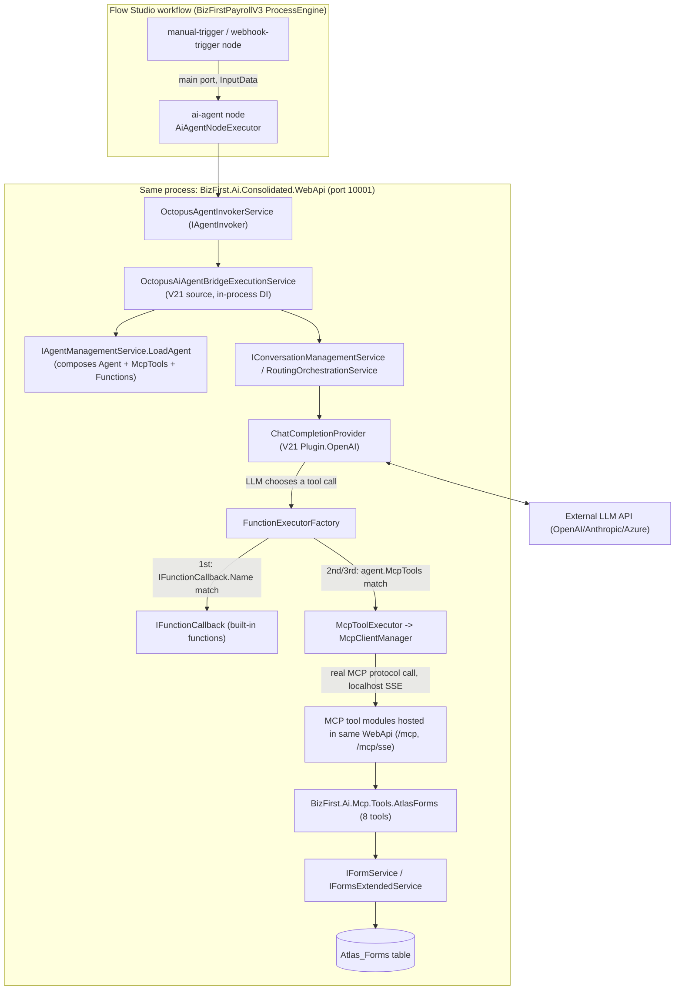

# Atlas Forms RAG Automation — Architecture & Status

Snapshot published 2026-08-23 from the live working docs in
`Employees\agentic-coding\atlas-form-automation-project\` (`STATUS.md`, `architecture.md`,
`design-and-plan.md`, `lessons\README.md`) — those remain the actively-updated source of truth; this
page is an edited, de-duplicated synthesis of them for a developer who wasn't there for the sessions.

## Read this first: what this project is

Goal: a real, working Octopus AI agent that can build and edit **Atlas Forms** through natural-language
conversation, backed by the Atlas Forms v2 RAG spec (`Knowledge\Form\atlas-forms-rag\v2\`,
74 files) and the 8 real Atlas Forms MCP tools, proven end-to-end via a Flow Studio workflow that
actually creates and edits a sample form.

**Status at a glance, as of 2026-08-23:**

| Capability | Status |
|---|---|
| Atlas Forms MCP tools (`create_form`, `find_forms`, etc.) | **Live and confirmed working.** Real `tools/list` and `tools/call find_forms` succeeded against production code paths. |
| Atlas Forms Agent (AgentID 23, "Atlas Forms Agent", TeamID 9) | **Exists, MCP-wired, confirmed live.** |
| `knowledge_retrieval` / `memorize_knowledge` functions | **Built, wired, proven end-to-end** against a real Postgres/pgvector (Supabase) backend — real content, real cosine-similarity scores. |
| 74 Atlas Forms RAG spec docs → Knowledge Collection | Uploaded (`Doc_Documents` rows exist), but **not yet embedded/searchable** — see gaps below. |
| Local Qdrant vector store | **Not running** — no Docker on the dev box. Any RAG content indexed through the Qdrant path (as opposed to the Postgres path proven above) is not actually retrievable yet. |
| Flow Studio workflow calling the agent to create a form | **Attempted for real, not yet successful.** Full mechanical pipeline (trigger → agent → real LLM call with tools attached) proven live; the agent never actually emitted a `create_form` tool call across 6 attempts. See [§6](#6-the-flow-studio-live-test-what-actually-happened). |

The rest of this doc explains *why* — how agent execution actually works in this codebase, what's
proven to work, what's genuinely blocked, and the concrete lessons worth carrying into the next session.

---

## 1. How agent execution actually works: V21 is in-process, not a network hop

The single most important architectural finding of this project: an AI Agent node's "bridge" into
`BizFirstAI.V21` (the legacy Octopus engine) is **not a network call**. `OctopusAgentInvokerService`'s
own doc comment talks about "bridging to the V21 AI Engine," which describes a real split across two
source repos — but both repos compile into the **same running binary**,
`BizFirst.Ai.Consolidated.WebApi`. V21's Octopus Core, ProcessEngine adapter, and OpenAI/SQL-storage
plugin projects are pulled in via direct `<ProjectReference>`s in the Consolidated WebApi's `.csproj`
files. The real bridge implementation (`OctopusAiAgentBridgeExecutionService`) does plain DI resolution
(`_services.GetRequiredService<IAgentManagementService>()`) — no `HttpClient`, no connection string, no
base URL anywhere in the class.

**Practical implication for anyone working in this codebase**: "V21" in a class name or doc comment
means *a different source repo*, not *a different running process*. Check `.csproj`
`<ProjectReference>`s before assuming a network boundary from naming alone.

**Nuance that does matter**: not all of V21 is loaded into the live binary. The live host's
`PluginLoader:Assemblies` config (in the Consolidated WebApi's `appsettings.json`) lists only
`BizFirst.Ai.Octopus.Core`, `Plugin.SqlServerAtlasStorage`, and `Plugin.OpenAI`. **`BizFirst.Ai.Octopus.Plugin.KnowledgeBase`
is not in that list and has no `ProjectReference` anywhere in the live host** — its
`KnowledgeRetrievalFn`/`KnowledgeHook` code is real, compilable V21 source that the running process
genuinely never loads. That's why this project built a brand-new plugin instead of enabling the old one
(§4).

### Component diagram

The MCP "hop" (`McpToolExecutor` → `MCPServer`) *is* a genuine network call — real SSE MCP protocol
over `https://localhost:10001/mcp/sse` — it just happens that the same process is both client and
server today. The agent-execution "bridge" above it is not this kind of hop; it's a plain in-process
method call.

### Execution lifecycle, step by step

1. **Trigger fires** — simplest is a `manual-trigger` node (zero required config); a `webhook-trigger`
   works too for an external caller.
2. **`ai-agent` node executes** (`AiAgentNodeExecutor`, node type code `ai-agent`). Only two
   operations are wired today: `("message","send")` and `("message","chat")`. For `send`:
   validates `agentID` is present (the *only* mandatory field), copies `InputData` onto the bridge
   context, and calls `IAgentInvoker.InvokeAgentAsync`.
3. **In-process bridge into V21** loads the target `AIAgent_Agents` row (LLM config, instructions, MCP
   tool grants) and hands off to conversation/routing.
4. **Real LLM call with tool-calling.** `ChatCompletionProvider` builds the tool list from
   `agent.Functions.Concat(agent.SecondaryFunctions)` and sends it via the official OpenAI .NET SDK's
   `ChatTool.CreateFunctionTool` mechanism — a normal function-calling request; the model decides
   whether/which tool to call.
5. **Tool dispatch**, in strict priority order (`FunctionExecutorFactory.Create`):
   1. A DI-registered `IFunctionCallback` matching by `.Name` → built-in/native function.
   2. A `FunctionDef` with a static `.Output` template → mock/test executor.
   3. An `agent.McpTools` entry → `McpToolExecutor` → real MCP protocol call.
   4. Unresolved → logged as "Can't find function implementation of X."
6. **MCP tool executes**, if that's what was called — a genuine
   `ModelContextProtocol.Client.CallToolAsync` against the live server, which runs the
   `[McpServerTool]` method in-process against `IFormService`/`IFormsExtendedService`.
7. **Result flows back** through the bridge into the node's output data (`content`, `status`, cost/
   conversation metadata), and the node completes on `main` or `error`.

### MCP tools vs. built-in functions — two separate mechanisms, neither blocked by the DB tables that look empty

- **Built-in functions**: `AIFunction_AgentFunctions` has 33 rows, all with `Assembly`/`ClassName`/
  `MethodName` NULL — **irrelevant to real dispatch**. Real built-in functions are ordinary
  `IFunctionCallback`-implementing C# classes registered in V21's DI container, matched purely by
  `.Name`. That table is an unused admin/catalog layer.
- **MCP tools**: `AIMCP_McpTools` (11 rows, zero for Atlas Forms/Credentials/Workflow) is also **never
  read at dispatch time** — it's only an optional per-agent allow-list filter. Real tool discovery
  happens live: `McpToolAgentHook.OnAgentMcpToolLoaded` calls `mcpClient.ListToolsAsync()` on every
  agent load, a genuine MCP `tools/list` round-trip, and appends the results to
  `agent.SecondaryFunctions`. An agent with an empty allow-list still sees *every* tool the live server
  currently reports.
- Both paths converge at the same dispatcher, `FunctionExecutorFactory.Create`.

### How `toolServers`/MCP access actually attaches to an agent — two additive layers

1. **Baseline, DB-driven, per-agent**: `AIAgent_Agents.McpEnabled`/`McpServerGroupID` →
   `AIMCP_McpServerGroupMembers` → `AIMCP_McpServers`, resolved by `AgentTranslator.MapMcpTools` on
   every normal `LoadAgent` call (gated on `AgentGetRequest.Include.McpServerGroup`, which defaults
   `true` — not an opt-in).
2. **Instance-level override, per Flow Studio node**: the node's `Configuration.toolServers.servers[]`
   JSON key, merged additively on top of layer 1 via `ProcessEngineAgentOverrideSource.Apply(agent)`
   before tool discovery fires. Currently append-only, not an overwrite (a documented TODO in
   `LoadAgent`).

**Note on the DB `ConfigurationSchema` for the `ai-agent` node type**: it is confirmed stale — it
reflects an older API shape (`MessageSource`, a flat `ConversationScope` enum) that doesn't match the
current settings classes on multiple points. Don't author workflows against the seeded schema; use the
real fields documented in the companion RAG spec docs under
`bizfirst-ai-mcp-servers-spec\workflow-nodes-rag\nodes\ai-agent\`.

---

## 2. The Atlas Forms MCP tools and agent

`BizFirst.Ai.Mcp.Tools.AtlasForms` provides 8 real tools — `CreateFormTool`, `AddFormControlTool`,
`UpdateFormControlTool`, `RemoveFormControlTool`, `ReorderFormControlsTool`, `SetFormEnabledTool`,
`FindFormsTool`, `GetFormSchemaTool` — registered as `AIMCP_McpServers` row 8 ("Atlas Forms MCP
Server"), served over `https://localhost:10001/mcp/sse` alongside Credentials and Workflow-authoring
tool modules (28 tools total on that one endpoint).

**The agent**: `AgentID 23` ("Atlas Forms Agent"), TenantID 1, leads `TeamID 9` ("Atlas Forms Team"),
with a `AIAgent_TeamMembers` row ("Primary Form-Building Agent") listing all 8 tool names as
descriptive `Capabilities` metadata. The functional wiring that actually matters is separate from that
metadata: `AIAgent_Agents.McpEnabled=1`, `McpServerGroupID=8` → `AIMCP_McpServerGroupMembers` (active
row, `McpServerID=8`) → `AIMCP_McpServerGroups` (`ServerRole="Atlas Forms Service"`) → `AIMCP_McpServers`
row 8 (`IsActive=1`). All created 2026-08-19 as part of the original team setup — confirmed already
correct, no fix needed.

**Live-verified, not just traced**: a standalone MCP client connecting with header
`X-Mcp-Agent-Id: 23` got a real `tools/list` response containing all 8 Atlas Forms tools, and a real
`tools/call find_forms` returned genuine `Atlas_Forms` rows straight from `IFormService.SearchListAsync`
— not a stub, not "tool not found."

**A real open gap, not yet fixed**: MCP tool calls carry **no authorization enforcement** today. A
path-scoped middleware seeds a fixed identity for every `/mcp` request, but the actual
`[McpServerTool]` methods call services directly, bypassing `MapControllers()` — so
`[AuthorizeTenantAdminAttribute]`/`[AuthorizeRegularUserAttribute]` never run for an MCP call. Any agent
wired to these MCP servers can currently write Atlas Forms/Credentials/Workflow data with zero
authorization enforcement. Fine for a controlled test; a real gap to close before wider rollout.

---

## 3. RAG / knowledge retrieval

### What's built and proven

`knowledge_retrieval` and `memorize_knowledge` are real `IFunctionCallback` implementations, registered
the same way every other live built-in function is (`PluginLoader` reflection-scanning
`PluginLoader:Assemblies`), rather than trying to enable V21's old, disconnected `KnowledgeBase` plugin
(which points at a separate, dead knowledge subsystem — see §1). The new plugin,
`BizFirst.Ai.Octopus.Plugin.KnowledgeRetrieval`, calls the already-live
`IFlowRagKnowledgeService.SearchKnowledgeAsync` — the retrieval counterpart to the existing
`RagDocumentCreateProcessor` insert path. Registered against `AgentID 19` ("Rag," a pre-existing
utility agent — **not** the Atlas Forms agent; see the open item below).

This was proven to genuinely work end-to-end against a real Postgres/pgvector backend (Supabase,
Session Pooler for IPv4 reachability): `memorize_knowledge` wrote a real row, `knowledge_retrieval`
found it again with real cosine-similarity scores (0.79, 0.78) above the knowledge base's 0.7
threshold.

**A real, pre-existing bug found and fixed along the way**: `PostgreSQLFlowRagServiceExtensions
.AddPostgreSQLFlowRagProvider` registered a second, plain `NpgsqlDataSource` *after* the correct
vector-aware one — .NET DI's "last registration wins" meant every consumer, including Document RAG's
own insert path, got the wrong data source. **No Postgres-backed RAG write could have worked for
anyone before this fix.** Now fixed.

**A separate, still-open architectural inconsistency, flagged not fixed**: `PostgreSQLFlowRagProviderService`
does not read the Credential Vault at all — it connects via a single `NpgsqlDataSource` built once at
startup from `IConfiguration["FlowRag:PgConnectionString"]`. Only the Qdrant provider resolves its
endpoint through the vault. Document RAG's insert path has the same gap. Needs a product decision before
extending Postgres to honor a vault credential the way Qdrant does.

### What's uploaded but not yet usable

74 real RAG source files (5 Tier-1 + 69 Tier-2 Atlas Forms control docs, correctly excluding
`worked-examples\*.json`) were batch-uploaded through the real `document-manager` UI into the
`atlas-forms-automation` collection (`Doc_DocumentCollections.DocumentCollectionID = 1`, TenantID 1) —
confirmed via 74 `Doc_Documents` rows and 75 collection-membership rows. **Timing gap**: this upload
happened *before* the Postgres DI fix above landed, so none of the 74 documents were actually embedded
(`RagKnowledgeID` NULL on all membership rows). Re-indexing was dispatched as a follow-up but not
confirmed complete as of this snapshot.

**"Library Collections" vs. "Knowledge Collections" is a false distinction** — both are thin UIs over
the same `Doc_DocumentCollections` table (`api/v1/knowledge/collections` is explicitly documented in
code as "the vendor-facing 'Knowledge' equivalent of `BaseDocumentCollectionController`"). Don't spend
time picking between them; there's one collection to find.

### What's still genuinely blocked

- **Qdrant is not running locally**, and this dev box has no Docker. `RagDocumentCreateProcessor` fails
  open (documents save, embedding silently fails, only logs a warning) — any content indexed through the
  Qdrant path without Qdrant running is not actually retrievable. Needs a decision: install Docker +
  run Qdrant locally, or point dev config at a shared/cloud Qdrant instance.
- **No retrieval/search endpoint exists on the `Go.Documents`/`FlowRag` side the Knowledge UI itself
  writes to** — `BaseKnowledgeController`'s own code comment states this outright ("no search/query/
  retrieval endpoint... future work"). This is a separate knowledge stack from the
  `knowledge_retrieval` function built above (which talks to `IFlowRagKnowledgeService` directly, not
  through that controller) — the two don't share code today.
- There is also an older, unrelated ingestion surface (`BizFirst.Ai.AiRag.*`, `AIRag_*` tables,
  `/api/v1/ai/rag-documents/upload`) documented separately, tested against Qdrant *Cloud* rather than
  local Qdrant. **`document-manager` does not call these endpoints at all** — don't confuse the two RAG
  surfaces; they target different Qdrant instances and are unaware of each other.

### Open item worth resolving before relying on this further

`knowledge_retrieval`/`memorize_knowledge` are currently registered against **AgentID 19 ("Rag")**, a
pre-existing utility agent — this has **not** been confirmed to be the Atlas Forms project's own agent.
The real Atlas Forms agent is AgentID 23 (§2). Whether/how RAG retrieval gets wired onto agent 23
specifically is unresolved.

---

## 4. Flow Studio: how to build and run a workflow without the browser UI

Useful independent of this project: two ways exist to create `Process_ProcessElements`/
`Process_Connections` rows without a logged-in Flow Studio session — direct CRUD via
`BaseProcessElementController`/`BaseConnectionController`, or `BaseStudioWorkflowController`'s atomic
`POST api/v1/process-studio/workflows/save` (with `BaseStudioProjectController`'s
`create-with-structure` to spin up a brand-new App + Process + ProcessThread in one call).

**Minimal workflow**: a `manual-trigger` node (or `webhook-trigger`) wired via a `main` connection to
an `ai-agent` node with `Configuration = { "agentID": <ID>, "message": "<instruction>" }`.
`resource`/`operation` default to `message`/`send` (the simple non-HIL path — appropriate for a
scripted test).

**Executing it programmatically**: `POST /api/v1/process-engine/execution/execute-by-id`
(`[AuthorizeWorkflowExecutorAttribute]`) is the confirmed reliable way — see §6 for why the anonymous
path doesn't work for AI-agent nodes, and how a locally-minted JWT stood in for a browser login.

---

## 5. Getting authenticated without a browser session

The anonymous execution endpoint (`POST /api/v1/node-instance-runner/{processId}/{nodeId}`,
`[AllowAnonymous]`) fires an entire process correctly, but **its AI-agent-node path is broken for any
tenant whose real users don't happen to include a literal `UserID=1`**: the fallback identity is a
hardcoded `BackgroundJobIdentity.SystemUserId = 1`, and `ConversationManagementService.NewConversation`
does a tenant-scoped lookup (`WHERE TenantID=@t AND UserID=1`) that throws
`UnauthorizedAccessException` if no such row exists for that tenant. This is a real, reproducible
defect — not fixed, since fixing it is a design decision (give the anonymous path a real per-tenant
system identity), not a one-line patch.

**The workaround used, and it's legitimate, not a hack**: mint a JWT locally, signed with the
Consolidated WebApi's own dev `JWT:Key`/`Issuer`/`Audience` (openly present in its checked-in
`appsettings.json`), with the real claim types traced from source
(`BizFirstClaimTypes.UserID = ClaimTypes.NameIdentifier`, `BizFirstClaimTypes.TenantID = "tenantId"` —
exact casing matters, wrong casing fails silently with `"TenantID is required and must not be 0"`) for
a real existing user/tenant. This is the same technique this codebase's own `JwtTokenHelper.cs`
integration-test helpers use.

**Worth flagging as a standing security observation**: a dev JWT signing key committed in plaintext to
`appsettings.json` means anyone with repo read access can mint a valid token for any existing user,
admin included, with zero credentials. This sits alongside the "no MCP authorization enforcement"
finding in §2 as the same underlying pattern — auth mechanisms that are real but have a soft spot.

**Debugging tip specific to this codebase**: when a node execution fails, the DB-persisted error columns
(`ErrorMessage`, `ExceptionType` on `Process_NodeActivityLogs` and similar) are sometimes never
populated even on a hard failure. Always check the live console log around the exact execution
timestamp before trusting a DB "error" column being empty as meaning "it worked."

---

## 6. The Flow Studio live test: what actually happened

A real, non-simulated attempt was made to run the full loop (build workflow → execute → agent creates a
form → confirm in DB → agent modifies it → confirm in DB), using the technique in §§4–5.

**Result: partial.** The full mechanical pipeline — trigger → in-process V21 bridge → real OpenAI
completion call with agent 23's real tools and instructions attached → real `AIConv_Conversations` rows
— is proven live, for real, for the first time in this project. But across 6 independent attempts, the
agent **never actually emitted a `create_form` tool call**, so no form was created
(`Atlas_Forms` row count: 1341 before and after) and the modify step was never reached.

**Why, specifically**: Agent 23's own system prompt (read directly from `AIAgent_Instructions.Content`,
not assumed) mandates a deliberate two-phase flow — gather requirements conversationally, wait for
explicit user approval, *then* call `create_form`. This is a legitimate, by-design safety gate, not a
bug: a production form-building agent shouldn't create data on the first ambiguous message. Every
attempt to force it past this gate with prompt engineering alone (direct instruction, "no human will
reply," a fabricated inline prior turn, "this is your only turn") got the model to *narrate* intent
("Creating the form now...") but never emit the actual tool call.

**Satisfying the gate for real requires a genuine second conversation turn — and that path has two
independently confirmed defects**:

1. Explicit `conversationID` continuation (the documented mechanism, `Configuration.conversationID`) does
   not work for `operation:"send"` — supplying turn 1's real conversation ID as turn 2's `conversationID`
   still minted a brand-new conversation. This corroborates an earlier code-comment finding about
   `AgentSessionId` never being populated.
2. `operation:"chat"` (the dedicated HIL suspend/resume mechanism built for exactly this) did not
   actually suspend on turn 1 when invoked via `execute-by-id` — it fell back to identical `send`
   behavior. Not root-caused; flagged for a focused follow-up on
   `AiAgentNodeExecutor.ChatMessage.cs`'s HIL dispatch when invoked outside the Flow Studio UI's own
   execution path.

**Takeaway for whoever picks this up next**: a two-phase-by-design conversational agent cannot be
reliably forced into single-shot tool execution by prompt engineering alone. The multi-turn mechanism
has to actually work — and right now it doesn't, for either the simple or the HIL path. Fixing either
defect #1 or #2 above is the real next step to get an actual `create_form` call.

---

## 7. Known gaps and defects — running list

| # | Gap | Status |
|---|---|---|
| 1 | No authorization enforcement on MCP tool calls (`[McpServerTool]` methods bypass `MapControllers()`) | Open |
| 2 | Anonymous node-instance-runner path throws for AI-agent nodes on any tenant without a literal `UserID=1` | Open — design decision needed |
| 3 | `conversationID` continuation doesn't work for `operation:"send"` (`AgentSessionId` never populated) | Open |
| 4 | `operation:"chat"` doesn't suspend for HIL when invoked via `execute-by-id` | Open — not root-caused |
| 5 | Dev JWT signing key committed in plaintext in `appsettings.json` | Open — security observation |
| 6 | `PostgreSQLFlowRagProviderService` doesn't read the Credential Vault (Qdrant provider does) | Open — needs product decision |
| 7 | Double `NpgsqlDataSource` registration silently broke all Postgres-backed RAG writes | **Fixed** |
| 8 | `.md` content-type not handled by Knowledge Base upload (`KnowledgeService.Document.cs`) | **Fixed** |
| 9 | `knowledge_retrieval`/`memorize_knowledge` registered on utility AgentID 19, not confirmed to be Atlas Forms' own agent (23) | Open |

---

## 8. Environment blockers (infrastructure, not code)

- **Qdrant not running locally**, no Docker on the dev box — blocks Qdrant-path RAG retrieval.
- **74 uploaded RAG docs not yet embedded** — re-indexing needed after the Postgres DI fix landed;
  dispatched, not confirmed complete.
- **`document-manager` browser session logged out** at various points during this project — blocks
  UI-driven upload until an authorized session logs back in (the JWT technique in §5 is a viable
  alternative for API-driven work, but was not used for document upload).

---

## See also

- `Employees\agentic-coding\atlas-form-automation-project\STATUS.md` — the live, actively-updated
  status log this snapshot was drawn from.
- `Employees\agentic-coding\atlas-form-automation-project\architecture.md` — the full architecture
  trace, with additional detail on the `ai-agent` node's optional config fields.
- `Employees\agentic-coding\atlas-form-automation-project\design-and-plan.md` — original task plan and
  decision log.
- `Employees\agentic-coding\atlas-form-automation-project\lessons\README.md` — chronological findings
  log, more narrative detail than this doc's condensed version.
- `Employees\agentic-coding\bizfirst-ai-mcp-servers-spec\atlas-forms-design.md` — the 8 Atlas Forms MCP
  tools' own design doc.
- `Employees\atlas-forms\atlas-forms-rag\v2\` — the 74-file Atlas Forms RAG spec itself.
