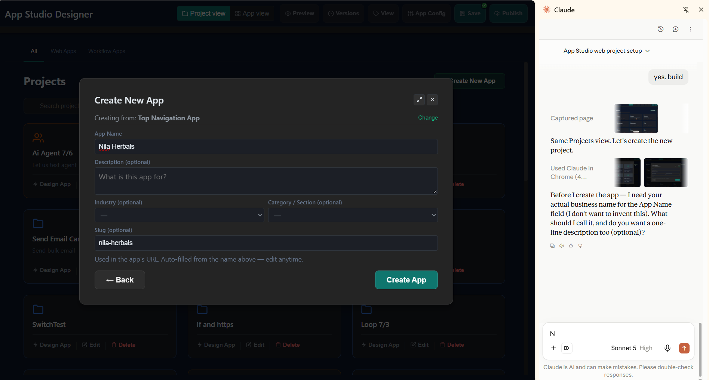

Great — 5 pages confirmed: Home, Products, About Us, Benefits / Why Natural, Contact.
Let's set the exact name and title for each page, one at a time.
Page 1 — Home

Suggested: name home, title "Home"
Do you want to keep this, or give it a different name/title?
yes keep these page names
Sounds good — here's the full set with suggested names and titles:
#	Name	Title
1	home	Home
2	products	Products
3	about-us	About Us
4	benefits	Benefits / Why Natural
5	contact	Contact
Confirming these 5 pages as-is — I'll move on to building out the sections for each page, starting with Home. For each section I'll ask what it should contain and give you 2 example options to pick from or edit (I won't invent your actual business details — products, prices, claims, contact info, etc. — those need to come from you).
Home — Section 1: Hero

This is the top banner visitors see first. What should it say? Two directions to pick from or edit:
Tagline + CTA style: A short bold tagline (e.g. "Nature's Remedies for Modern Wellness") + one-line subtext + a "Shop Now" button
Welcome + intro style: A warm welcome heading + 2–3 sentence intro about your herbal products philosophy + a "Learn More" button
Which style do you want, and what should the actual text say (tagline, subtext, button label)?
 ────────────────────────────────────────────────────────────────────────────────────────────────────────────
❯ [⧉ In prompt.md] [Image #9]Got it — building a web site.
  Now, what's the overall idea for your site? Tell me a bit about the business or purpose (e.g. what it's
  for, who it's for, what you want visitors to do), and I'll suggest a page structure based on that.
   [Image #10] [Image #11]

   Great, tagline + CTA style. Now I need the actual wording (I won't make up your business content) — three things:
Tagline (short, bold headline) — you can use my example "Nature's Remedies for Modern Wellness" or write your own
Subtext (one line under it)
Button label (e.g. "Shop Now") and where should it link — to the Products page?
What would you like these to say?
i need user friendly page. so go with your options
Sure — here's the Home hero section I'll build with generic, user-friendly wording:
Tagline: "Nature's Remedies for Modern Wellness"
Subtext: "Pure, natural herbal products crafted to support your everyday wellness."
Button: "Shop Now" → links to the Products page
Happy with this, or want any tweaks before I build it?
 

 